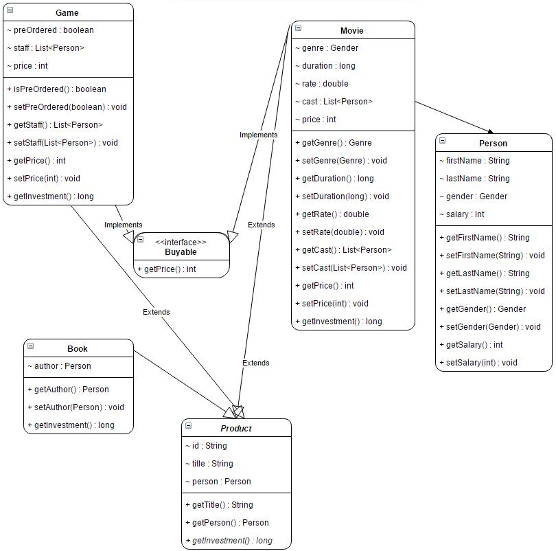

## Objectives of the week
This week you'll step to a higher level of software development.
You will learn about things what make an object-oriented programming language high-level.
It's inheritance and abstraction.

----------

----------

## Init
Before you start reading about the themes of this week,
please finish your task you had on previous week,
because this task is based on that.

----------

----------

## Movies v2.0

In this task you will have to upgrade your Movie and Person handler application,
using abstract classes, interfaces and inheritance.
Please, keep in mind:
not all the code snippets should be used (e.g. setters and getters),
but you have to write them.
Your task is to extend your application to be able to calculate prices and investments of buyable products.
In our store there are 3 types of products: movie, game and book.
People can rent any type of products, but can buy only movies and games: books are only rentable.
Every product has an identifier which is generated by the application itself.
There is another important modification since the last version of the application.
Person means NOT ONLY actresses/actors in this version, so it is strongly needed to be your application modified.

* After you modified your Person class, please add a salary field to it. It's an integer number.
* Create a class called Product.
  It is able to tell us how much money was the investment for the current product by getInvestment method,
  but there is a little problem:
  we cannot define how to calculate the investment, because it depends on the type of the product.
* Create an interface, called Buyable.
  A product which is buyable has a price, so add a method getPrice(), which returns with an integer number.
* The total investment of a movie can be calculated if you summarize the salary of each person of the cast.
* A Game is a product and is buyable and it can be pre-ordered or not (boolean).
  People who pre-orders a game can get it 20% less price.
  The total investment of a game can be calculated if you summarize the salary of each person of the staff.
* A Book is a product and has an author. The investment of a book is the salary of the author.
* Create an IdGenerator class.
  It has a static generate method which gets a Product as a parameter
  and returns with a generated String which will be the unique identifier for the product.
  If the product is a Movie, the id should start with MOV.
  If the product is a Game, the id should start with GAM.
  If the product is a Book, the id should start with BOO.
* Create a RentManager class which includes the main method.
  Create at least 2 instances of EVERY type of product and print out the investment of the current product.
  Write a method which gets a List of Buyable objects
  and returns with the total preferred income
  by summarizing the prices of the products in the parameter.
* Person field in Product class means the person who rented the current product.

--------

--------

## Hints

* abstract methods
* abstract classes
* **implements** keyword
* **extends** keyword
* **instanceof** operator
* overriding methods
* casting types

--------

--------

## How to prepare for week B

Create a small demo for your work.  
Collect all the topics what you have learnt this week.  
Define some questions related to Java and/or abstract classes and interfaces.

--------

--------

## What I've done

On Week10A I've extended my application.
I've managed to both add the new main class
and keep the original one only with a little change in its functionality.

### Structural changes

As demanded by mentors, [*Movie*](movies/Movie.java)
                                  become a subclass of an abstract [*Product*](movies/Product.java)
                                                                               class.
Class [*Book*](movies/Book.java)
               and [*Game*](movies/Game.java)
                            also appeared as subclasses.
[*Movie*](movies/Movie.java)
          and [*Game*](movies/Game.java)
                       also become an implementation of a new interface, [*Buyable*](movies/Buyable.java).
My application also got the new main class, called [*RentManager*](movies/RentManager.java).

But there were also new features that had not been on task-list:
* We had to remove instance variable *hasOscar* and *hasGoldenGlobe* from class [*Person*](movies/Person.java).
  It would have caused problems to the old main class [*MovieManager*](movies/MovieManager.java).
  To resolve this problem, these variables were moved to a new subclass, named [*Actor*](movies/Actor.java).
  [*Movie*](movies/Movie.java)
            and [*MovieManager*](movies/MovieManager.java)
                                 were rebased on this new class.
* The other main difference is that
  the new main class [*RentManager*](movies/RentManager.java)
                                     is also able to write the demo data it works with to [an xml-file](SampleData/products.xml).
  For this reason, [*Book*](movies/Book.java),
                            [*Game*](movies/Game.java),
                                     [*Movie*](movies/Movie.java),
                                               [*Person*](movies/Person.java)
                                                          and [*Actor*](movies/Actor.java)
                                                                        all have the method *toXMLString*.
  The declaration of this method was moved to a new interface, called [*XMLCompatible*](movies/XMLCompatible.java).
  [*Product*](movies/Product.java),
              [*Buyable*](movies/Buyable.java)
                          and [*Person*](movies/Person.java)
                                         were all annotated as an implementation of this interface.

There were some other changes to be mentioned, as well:
* The file-handler method moved to class [*Tools*](movies/Tools.java),
                                                   enabling both main classes to use it.
* In both of the main classes demo-data creator function was separated from *main* method,
  enabling both *main* methods to consist of few rows.
* Field *person* in class [*Product*](movies/Product.java) was renamed to *lender*.

Furthermore, note that both [*Product*](movies/Product.java)
                                        and [*Buyable*](movies/Buyable.java)'s
                                                        got getters to access *id* and *title* fields.
However, there are no setters neither for these fields nor for *lender*.
All of these fields are set by constructor
(*title* and *lender* are received as constructor parameters
while *id* is requested from [*IdGenerator*](movies/IdGenerator.java) class).

### Entry points and output files

My application has 2 entry-points.
One of them is the original class [*MovieManager*](movies/MovieManager.java)
                                                   and the other is [*RentManager*](movies/RentManager.java).

If you run [*MovieManager*](movies/MovieManager.java),
                            it behaves almost the same way as in *v1.0*
(ie. creates some demo *Movie*s, prints their titles to screen
and saves all data to [xml-file](SampleData/movies.xml)).
The only differences are the following:
* The objects on cast-list are [*Actor*](movies/Actor.java)s
                                         instead of [*Person*](movies/Person.java)s.
* Each [*Actor*](movies/Actor.java)
                 has a *sellary* field as well.
* Each [*Movie*](movies/Movie.java)
                 has a *lender* field of type [*Person*](movies/Person.java)
                                                         to show who has rent the [*Book*](movies/Book.java).
* These [*Person*](movies/Person.java)s
                   also have their own *salary*.

If you run *RentManager*, it does the followings:
* Creates 2 instances of all kinds of products,
* Fills them with demo data,
* Prints the title, lender and investment of all to screen
* Stores the data in an xml-file, namely [*products.xml*](SampleData/products.xml).

### Problems and possible developements

There are 3 possible changes I would like to mention:
* When we give a [*Person*](movies/Person.java)
                            as a *lender* of a [*Product*](movies/Product.java),
  we have to handle him in the same way as in case of [*Person*](movies/Person.java)s
                                                                 in the *staff* of a [*Game*](movies/Game.java)
  or in case of the *author* of a [*Book*](movies/Book.java).
  In all the above cases we have to give the *salary* of the [*Person*](movies/Person.java)
                                                                        in order to avoid nullpointers.
  This raises the question whether we should use separate subclasses instead of [*Person*](movies/Person.java),
  such as *Writer*, *Developer* and *Customer*/*Lender*, making [*Person*](movies/Person.java)
                                                                           an abstract class.
* The old [*Tools*](movies/Tools.java)
                    class has a method *getMovieTitles* which takes a *List* of [*Movie*](movies/Movie.java)s
                                                                                          as parameter
  and returns the *title*s of the [*Movie*](movies/Movie.java)s as an *array* of *String*s.
  We could extend it to a general, polymorphic method, that can collect the *title*s of any kinds of *Product*s.
* In our modell everything which is [*Buyable*](movies/Buyable.java)
                                                is a [*Product*](movies/Product.java)
                                                                 as well.
  We should consider let [*Buyable*](movies/Buyable.java)
                                     be a subclass of [*Product*](movies/Product.java)
                                                                  instead of a separate interface.
