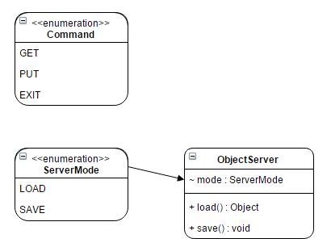

## Objectives of the week

This week you'll step to a higher level of software development.
You will learn about serialization, deserialization and basics of networking in Java.

--------

--------

## Init

Before you start reading about the themes of this week,
please finish your task you had on previous week,
because this task is based on that.

--------

--------

## Movies v3.0

In this task you will have to upgrade your Product and Buyable handler application,
using serialization and networking.
Please, keep in mind: not all the code snippets should be used (e.g. setters and getters),
but you have to write them.
In this task you will have to create a new class, called ObjectServer,
but you will have to be able to run this class as a separated application, so it has to have a main method.
This class should be able to send and receive objects over TCP,
working as a server (hint: ServerSocket should be initialized in this class).
The RentManager and the ObjectServer should communicate with each other using sockets
(they should run in separated JVMs).
ObjectServer should be able to save given data to a file and load data from file, depends on its mode property,
so it should be declared in this class.
You should modify your Person class and every product class,
because they are needed to be able to read/written by ObjectInputStream/ObjectOutputStream.
Create an enum which contains 3 values: GET, PUT and EXIT.
Any of these values can be sent to the server which can process these "commands" and switches its mode:
GET means the server should read the file which contains the previously stored data and send it to the caller.
PUT means the server should be switched to "store" mode,
so the data which is sent to the server after PUT command should be stored in a file
(PUT command and the data are different objects !!!).
EXIT means the server should shut down and the sockets are needed to be closed.

* Create ServerSocket in ObjectServer and start an infinite loop,
  so the server can only be shut down when RentManager sends it an EXIT command
* ObjectServer should use ObjectInputStream and ObjectOutputStream
  for communicating with RentManager and handling files.
* RentManager should use ObjectInputStream and ObjectOutputStream for communicating with ObjectServer
* ObjectServer communicates with RentManager by sockets.
* After RentManager sent GET, ObjectServer should be switched to LOAD mode,
  so it should load the file which contains previously stored data and should send it to client,
  so it will be readable in the socket's inputstream in the RentManager class
* After RentManager sent PUT, ObjectServer should be switched to SAVE mode,
  so every object which is sent by RentManager after this moment should be stored in a previously opened file.
* After RentManager sent EXIT, ObjectServer should be shut down:
  infinite loop should be terminated and JVM should be exited.
* Person and every product class should implement java.io.Serializable
* There is only 1 file needed for storing data.
* If you don't have a previously stored data in a file,
  instantiate some objects in RentManager and send them to ObjectServer after you sent a PUT command.

--------

--------

## Hints

* java.io.Serializable
* java.io.ObjectInputStream
* java.io.ObjectOutputStream
* java.net.ServerSocket
* java.net.Socket
* java.net.URL
* TCP

--------

--------

## How to prepare for week B

Create a small demo for your work.  
Collect all the topics what you have learnt this week.  
Define some questions related to Java and/or serialization and networking.
